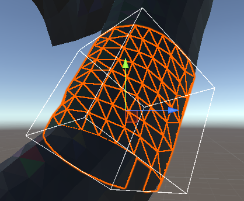

# MathGeoLib.Exports

- adds C exports for oriented bounding box
- adds trivial C# wrapper + support for Unity

Users, grab it at https://github.com/aybe/MathGeoLib.Exports/releases.

Forkers, you will also need https://github.com/aybe/MathGeoLib.

